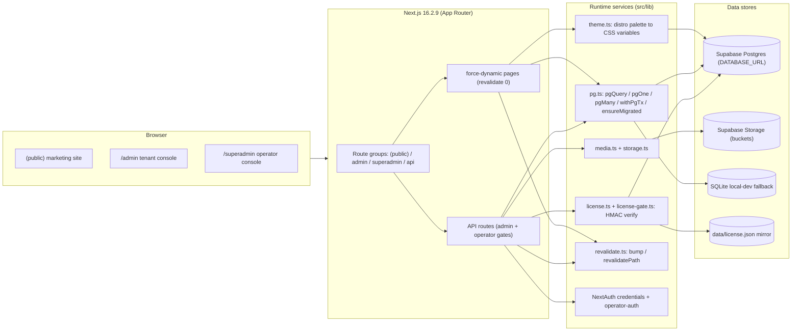
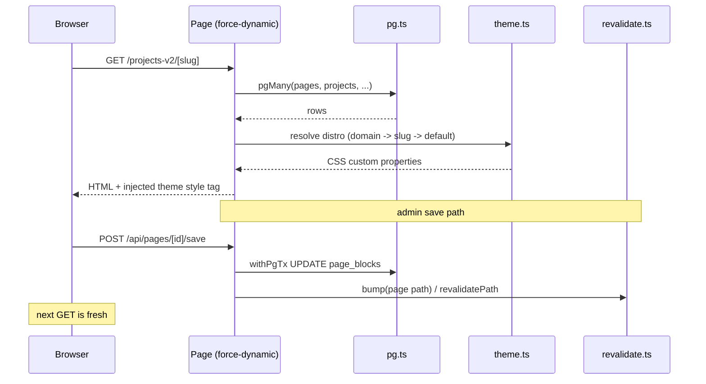
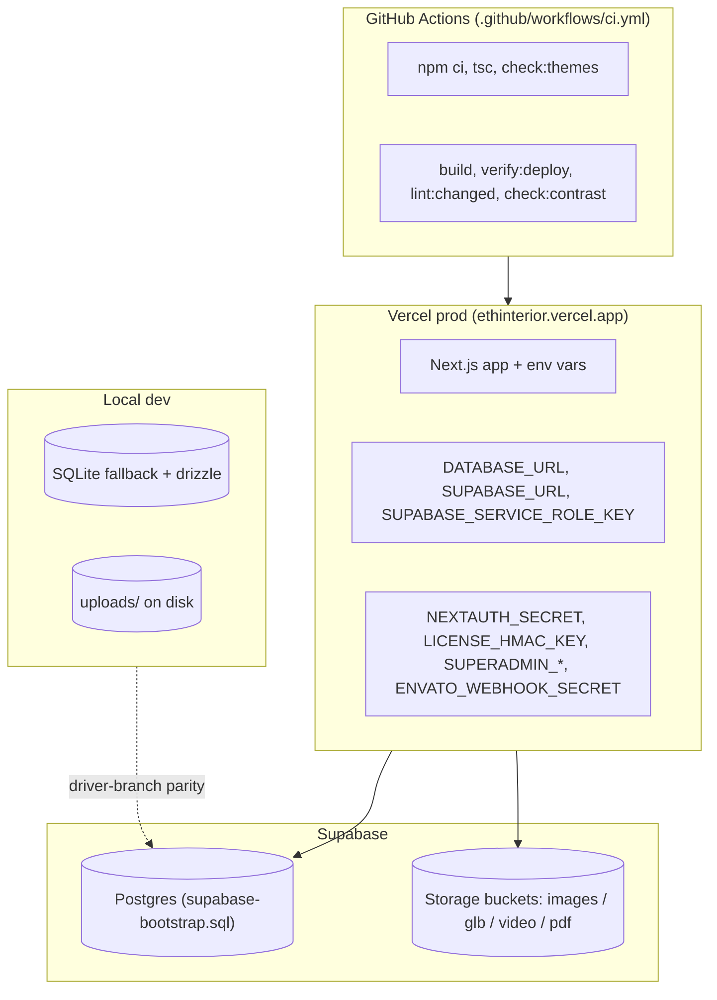
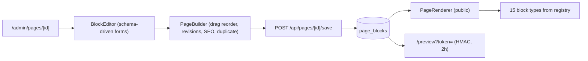

# MASTER INTERIOR - Complete Project Knowledge Base

**Repo:** `github.com/rasikfakih/interior`
**Live demo:** `https://ethinterior.vercel.app`
**Version:** v1.18.0 (2026-08-14)
**Product:** Premium residential interior-design theme, sold on Envato, hosted as a multi-tenant white-label SaaS for interior studios.

This document is the single entry point for a new AI agent (or human) joining this project. It explains what the project is, why it exists, how it is built, what has been done across its history, the current state, the open items, and the operational protocol. It is deliberately redundant with `docs/CONTEXT.md` (the append-only session narrative), `FREEZE-MARKER` (the frozen-surface contract), and `CHANGELOG.md` (the release history) so that reading this one file is enough to get oriented. Section 14 holds the Mermaid architecture diagrams, the visual versions of sections 3-5.

---

## 1. What this is (the short version)

A Next.js-based marketing-site theme for interior design studios. Two products come from one codebase:

| Product | What it is | Who sees it |
|---|---|---|
| **The Studio demo** | The live site at `ethinterior.vercel.app`, painted with the Etihad Interiors brand (tenant 1, slug `studio`). Drives Envato sales. | Envato prospects, studio visitors |
| **The Theme** | The same codebase white-labelled to a buyer's own studio. A buyer runs `./install.sh --code=... --domain=... --tier=...` and gets their own branded site, hosted by the studio (or self-hosted). | The buyer's customers |

The business model: the studio hosts and supports buyer installs. The buyer gets a WordPress-grade editable site (projects, journal, testimonials, team, pages, media, menus, forms, redirects, theme customizer) plus an operator back office run by the studio (license issuance, theme distribution, health monitoring, backups, usage metrics, login-as support).

The Envato sale flow: buyer purchases -> Envato pings `/api/envato/webhook` -> a pending tenant row is created -> the studio operator approves it in `/superadmin`, issues an HMAC-signed license, applies a theme distro -> the buyer runs the install script with the issued payload.

There is **no separate operator demo**. The operator console at `/superadmin` is internal (gated by `SUPERADMIN_EMAIL` / `SUPERADMIN_PASSWORD` env vars) and buyers never see it.

---

## 2. Why it exists (origin and motivation)

1. **Sellable Envato theme (v1.0 - v1.1).** Originally a static-ish marketing template with a demo brand, sold on Envato. Key differentiator: white-labeling via a per-tenant theme distribution file, not a hardcoded brand.
2. **The durability crisis (v1.1.2).** The first deploy ran on a bundled SQLite file. Vercel's filesystem is ephemeral across cold starts, so admin writes looked successful but vanished on the next container. The operator requested a full migration to Supabase Postgres. This is the single most important architectural turn in the project's history: a driver-branch data layer where Postgres is the production store and SQLite is the local-dev fallback.
3. **Hosted multi-tenant pivot (v1.10+).** The operator decided the product is a hosted theme service: the studio hosts buyer installs on one codebase, one Postgres, one operator console. The demo cut (v1.10.0) repointed all public links at the v2 projects surface and added the uptime/health probes the studio needs to support buyer sites.
4. **StudioOS platform plan (v1.11 - v1.18).** A 7-phase plan (see `docs/PLATFORM-V2-PLAN.md`) that turned the theme into a real platform: theme customizer, menus, page revisions, draft preview, per-page SEO, page duplication, forms builder, redirects manager, users/roles, per-room 3D walkthroughs, public motion pass, the superadmin back office, and import/export/backup. Phases 0-6 are shipped; Phase 7 (i18n) is parked.

---

## 3. Stack (exact versions and choices)

| Concern | Choice | Notes |
|---|---|---|
| Framework | Next.js 16.2.9 (App Router) + TypeScript | RSC by default; route groups; `force-dynamic` on editable pages |
| React | 19.2.4 | `next-view-transitions@0.3.5` wraps Link/router with `document.startViewTransition` (React 19.2 stable has no native `<ViewTransition>`) |
| Styling | Tailwind v4, CSS-first config | Theme tokens as CSS custom properties in `src/app/globals.css`; no `tailwindcss` plugin in PostCSS |
| Animation | Motion (`motion/react`) for UI; GSAP for scroll-pinned hero and motion passes; Lenis smooth scroll | `src/lib/use-gsap.ts` provides shared `useGSAP` + `useReducedMotion` hooks |
| 3D | three.js + `@react-three/fiber@9` + `@react-three/drei` | Lazy-loaded (`three-runtime.tsx`), behind the license gate |
| Rich text | TipTap (`@tiptap/react` + starter-kit + image/link/placeholder) | `RichTextEditor` (admin) + `RichTextRenderer` (public) |
| Auth | NextAuth v4 (credentials provider) | Session augmented in `src/types/next-auth.d.ts` (id, role, email, name) |
| Database | Supabase Postgres (prod via `DATABASE_URL`); better-sqlite3 + drizzle-orm 0.45 (local dev fallback) | Raw `pg` helpers (`src/lib/pg.ts`) are the runtime surface; `schema.ts` (drizzle sqlite-core) is the typed schema mirror |
| Storage | Supabase Storage via `@supabase/supabase-js` SDK (prod); disk under `/uploads` (local) | `src/lib/storage.ts` + `media.ts`; per-kind size caps |
| Icons | `@phosphor-icons/react` (duotone) | `src/components/icons.tsx` is the shared icon surface |
| Drag | `@dnd-kit/core` + `@dnd-kit/sortable` | PageBuilder block reorder |
| License | HMAC-SHA256 signed offline JSON | Verified at request time; `license_doc` singleton table (Postgres-backed since v1.18.0) |
| Package manager | npm | `postinstall` chain: migrate -> seed-pages -> apply-distro -> stamp-demo-license |
| CI | GitHub Actions (`.github/workflows/ci.yml`) | npm ci, tsc, check:themes, build, verify:deploy, diff-scoped eslint gate (`lint:changed`) |

**Ground rules that are non-negotiable (enforced by skills):**
- No emojis anywhere visible (code, comments, chat, text).
- No em-dashes in user-visible text; use an ASCII hyphen. (A CI-adjacent discipline; em-dashes are a classic AI tell.)
- No `Inter` as the default font; the project uses Geist / Outfit / Cabinet Grotesk / Newsreader (display serif).
- Taste rules for marketing pages: no 3-column equal feature cards, one accent color per page, one radius scale per page, `min-h-[100dvh]` not `h-screen`, real images not div-screenshots, reduced-motion support for anything animated, max 1 eyebrow per 3 sections, never center a hero unless editorial.
- Operator/admin surfaces skip the marketing-only taste rules but keep form density, monospace IDs, clear labels.
- The taste skill lives at `~/.opencode/skills/taste-skill/SKILL.md` (mirrored at `.opencode/skills/taste-skill/`) and must be read before any frontend decision.

---

## 4. Architecture

> Visual versions of the system map, editable-page data flow, deployment topology, and license lifecycle live in section 14 (Mermaid diagrams).

### 4.1 Rendering model

- App Router with route groups. Marketing pages live under `src/app/(public)/` with their own `layout.tsx` (Navbar, Footer, I18nProvider, theme injection). The root layout only provides SessionProvider + ThemeProvider + I18nProvider.
- All pages that depend on admin-edited data render dynamically (`force-dynamic` / `revalidate = 0`). Admin writes call `bump()` / `revalidatePath` (`src/lib/revalidate.ts`) so the next request sees fresh state. This is the "WordPress-grade live update" contract.
- The theme engine (`src/lib/theme.ts`) resolves the tenant distro palette from Postgres (domain -> slug -> default tenant), derives the full CSS custom-property set (light + dark), and injects it into the `(public)` layout as a `<style>` tag. Fallback order: distro row -> `data/studio-brand.json` -> `globals.css` defaults.

### 4.2 Database model

Runtime data access goes through `src/lib/pg.ts` (`pgQuery` / `pgOne` / `pgMany` / `withPgTx` / `ensureMigrated`). `ensureMigrated` applies the schema idempotently on cold start (advisory-locked on Postgres). Three DDL surfaces must stay in sync: `supabase-bootstrap.sql` (Postgres), `src/lib/sqlite-fallback-ddl.ts` (local SQLite), `scripts/migrate.mjs` (migrations + additive ALTERs). `src/lib/schema.ts` is the drizzle (sqlite-core) typed mirror used by dev tooling.

Tables (the full live schema is wider; the key ones):
- Identity/tenancy: `users` (with `role` admin/editor/superadmin, `tenant_id`, `is_active`), `tenants`, `tenant_data` (`kind = 'distro'` rows hold the per-tenant theme distro JSON), `license_doc`, `license_log` (audit + `revenue_cents`)
- Content: `projects` (+ `before_image`, `after_image`, `model_3d`), `project_rooms` (per-room GLB + hotspots), `journal_posts`, `testimonials`, `team_members`, `media`, `pages` + `page_blocks`, `menus` + `menu_items`, `settings`, `site_identity`, `translations`, `revisions`
- Platform: `form_definitions` + `form_submissions`, `redirects`, `usage_events`, `announcements`, `hmac_audit`

### 4.3 The license system

Offline, HMAC-SHA256-signed JSON (`src/lib/license.ts`). The license payload carries purchase code, domain, tier, timestamps, signature. Verified at request time (`src/lib/license-gate.ts`): missing -> "missing", expired, domain-mismatch, tampered, no-signature all map to distinct 423/403 responses. Public reads stay open without a license; admin and 3D are gated; tier features (3D viewer, multilingual) return 423 when the tier is insufficient. The signer + verifier share a canonical-body serializer (`src/lib/license-key.test.ts` demonstrates the round trip). Since v1.18.0, `readLicense`/`writeLicense` are DB-canonical (`license_doc` singleton) with a first-read import from `data/license.json` and a best-effort file mirror; DB failure degrades to the file.

### 4.4 Auth and roles

NextAuth v4 credentials provider against the `users` table. Three roles: `admin` (tenant content), `editor` (content but not user management), `superadmin` (studio ops). The operator console uses `src/lib/operator-auth.ts` (env-gated cookie session). Superadmin can "login-as" a tenant admin: the route records `admin.login-as` in the audit log and mints a real NextAuth JWT session for the impersonated user (same secret as credentials).

### 4.5 The block CMS

The public site is assembled from DB-driven blocks:
- `src/cms/blocks/registry.ts` defines 15 block types: hero, principles, services, selected-work, process, testimonials, journal-preview, spatial-walkthroughs, closing-cta, rich-text, image, image-grid, divider, spacer, form.
- `src/components/admin/block-schemas.ts` defines a per-type `BlockSchema` (scalar fields + array schemas) with kinds text/longtext/number/select/richtext/media/toggle.
- `src/components/admin/BlockEditor.tsx` renders the schema-driven forms (delegating richtext to TipTap and media to MediaPicker). `PageBuilder.tsx` hosts the editor with drag-reorder, save, revisions, SEO panel, duplicate, preview.
- `src/components/PageRenderer.tsx` renders blocks on the public side, with per-block data types exported from consumer components and cast at the wrapper boundary (block data is `Record<string, unknown>` under the hood).
- Draft preview: HMAC-signed 2h token via `POST /api/pages/[id]/preview`; `/preview?token=` renders any page (draft or published) under a noindex banner.

### 4.6 Media

`src/lib/media.ts` + `storage.ts`. Uploads go to Supabase Storage in prod (signed PUT/GET URLs, per-kind caps: image 8MB, glb 25MB, video 80MB, pdf 25MB, raw 50MB) or the local filesystem in dev. The media library (`/admin/media`) supports upload, alt text, folder, pin, delete. `MediaPicker` is used across admin forms. All admin image previews route through `next/image` with `unoptimized` (srcs are runtime-arbitrary; the loader is bypassed so no remotePatterns widening is needed).

### 4.7 3D walkthroughs

- `Model3DViewer` (public) and `three-runtime.tsx` (the actual R3F canvas): ACESFilmicToneMapping, 3-point lighting, auto-fit any GLB to a 2.6-unit cube, animated camera presets, fullscreen toggle, GLTF progress bar, poster fallback + error boundary, reduced-motion respect, `trackUsage` opt-out for operator previews.
- Per-project rooms: `project_rooms` table, `ProjectRoomsManager` in the admin form, `ProjectRooms` server component on `/projects-v2/[slug]`. A room without its own GLB falls back to the project model.
- Seed GLBs: `public/models/seed/reception-room.glb` (project fallback) + `public/models/rooms/*.glb` (procedurally generated placeholder rooms).

### 4.8 i18n

`I18nProvider` (client context) over JSON locale files (`public/locales/{en,hi,mr}/common.json`) with a `t(key)` lookup and a language switcher in the Navbar. The switcher is currently near-decorative (it does not persist a preference) - this is the top open item before the demo. The old `i18next` init module was deleted (TS-ID-019); `i18next` / `react-i18next` / `i18next-http-backend` deps are now unused and removable.

### 4.9 The two consoles

**Tenant admin (`/admin`)** - what the buyer edits:
- Projects (rich text, gallery, 3D model, per-room walkthroughs, publish/unpublish)
- Journal (categories, rich text)
- Testimonials, team
- Pages (drag-reorder block builder, SEO panel, revisions, preview, duplicate)
- Media library
- Menus (primary + footer, DB-driven navbar)
- Forms (builder + submissions inbox + CSV export)
- Redirects (301/302, DB-driven, no rebuild)
- Users (admin/editor/superadmin, self-protection rules)
- Theme customizer (palette, fonts, density, radius, motion; live AA contrast rows; 8 presets)
- Site identity, settings, newsletter, license, export/import

**Operator console (`/superadmin`)** - studio-only:
- Tenants list + detail (tier, state, expiry, HMAC key, health status)
- License wizard (`/superadmin/issue`): issue/extend/revoke; revenue ledger in cents
- Health board (`/superadmin/health`): live per-tenant `/api/health` probes, persisted status
- Metrics (`/superadmin/metrics`): tenants, revenue (total/30d/by-tier), usage (pageviews, 3D loads, form submits), audit trail
- Backup (`/superadmin/backup`): snapshot every table to one JSON file; download
- Theme distributor (`/superadmin/theme`): paste/apply a `theme.distro.json` per tenant; preset quick-pick
- Announcements (CRUD + public banner)
- Login-as (impersonate any tenant admin)
- HMAC rotation, demo reset

### 4.10 Envato intake

`/api/envato/webhook` (server-to-server, `ENVATO_WEBHOOK_SECRET`) creates a `PENDING_TENANT` row on purchase. License is NOT auto-issued; the operator approves in `/superadmin` and issues manually. `/install` writes `data/license.json` keyed to the buyer's domain; `./install.sh --code=... --domain=... --tier=...` wires it up. `scripts/stamp-demo-license.mjs` stamps the local demo license and refuses cleanly on serverless read-only hosts.

---

## 5. The API surface (complete route list)

Public: `GET /api/health`, `GET /api/health/db`, `GET /api/sitemap`, `GET /api/announcements`, `POST /api/contact`, `POST /api/newsletter`, `POST /api/forms/submit`, `GET /api/forms/public/[slug]`, `POST /api/install/stamp`, `POST /api/auth/...` (NextAuth), `GET /api/media/[id]/sign`.

Content CRUD (admin-gated): `/api/projects` + `[id]` (+ `/rooms`, `/rooms/[roomId]`), `/api/journal` + `[id]`, `/api/testimonials` + `[id]`, `/api/team` + `[id]`, `/api/pages` + `[id]` (+ `/blocks`, `/save`, `/duplicate`, `/preview`, `/revisions`, `/revisions/[revId]/restore`), `/api/media` (+ `/list`, `/upload`, `/upload/local`, `[id]`), `/api/menus`, `/api/forms` + `[id]` (+ `/submissions`, `/submissions/read`, `/submissions/export`), `/api/redirects` + `[id]`, `/api/settings` + `[key]`, `/api/site-identity`, `/api/theme`, `/api/users` + `[id]`, `/api/export`, `/api/import`, `/api/usage/record`.

Operator (superadmin-gated): `/api/operator/login`, `/api/operator/tenants` + `[id]`, `/api/operator/license`, `/api/operator/health`, `/api/operator/metrics`, `/api/operator/rotate-hmac`, `/api/operator/backup`, `/api/operator/announcements` + `[id]`, `/api/operator/login-as`, `/api/admin/audit`, `/api/admin/whoami`, `/api/admin/license`, `/api/admin/demo-reset`.

---

## 6. Scripts and gates

- `npm run verify:deploy` - the single pre-flight gate (node version, node_modules, build, vercel.json, DB reachability, env files, model seed, docs presence). 19/19 checks.
- `npm run lint:changed` - diff-scoped eslint gate: only changed files, only errors on lines the diff added. Untracked files count every line. This gate held the line while legacy lint debt existed; the debt is now fully cleared (0 errors / 0 warnings repo-wide as of TS-ID-020).
- `npm run check:themes` - validates the 8 theme presets against the distro contrast rule (AA).
- `npm run check:contrast` - a 618-line computed-style walker that logs into the app and measures WCAG AA contrast across surfaces (CI gate). This is why the `muted` token is `#56605A` (not the v1.9.0 `#626D66`, which failed on elevated surfaces).
- `npm run check:uptime` - probes `/api/health` on each tenant base URL (the operator's per-buyer-site monitor).
- Seeds/migrations: `npm run migrate`, `npm run seed` (pages), `npm run seed:content` (Postgres or SQLite by `DATABASE_URL`; 3 projects / 3 journal / 3 testimonials / 3 team / media / rooms, idempotent, `--force` re-asserts), `npm run migrate:supabase`, `npm run backup:postgres`.
- Smoke suite (each an authed/no-auth probe against a running server): smoke, smoke-api, smoke-role, smoke-save, smoke-live, smoke-coldstart, smoke-routes, smoke-projects-v2-detail, smoke-mobile, smoke-settings, smoke-site-identity, smoke-newsletter, smoke-install, smoke-editable-crossc, smoke-phase2/5/6 legacy.
- `node scripts/verify-brand-v190.mjs` - post-deploy acceptance probe that the live site serves Newsreader + the recalibrated Forest & Bone palette (13/13 checks).
- `node scripts/apply-distro.mjs --tenant=studio --file=...` - applies a theme distro (local SQLite; the live row is updated via the operator console or a direct `tenant_data` UPDATE with backups in `data/backups/`).
- Asset generation: `gen-demo-assets.mjs` (procedural JPGs via sharp), `gen-glb-reception.mjs`, `generate-placeholder-rooms.mjs`.
- `graphify:update` - rebuilds the knowledge graph at `graphify-out/` (AST-only, no API cost).

---

## 7. What has been done (release history, condensed)

- **v1.0.0 - v1.1.0**: skeleton (Next 16, Tailwind v4, license subsystem), demo assets, tenant model + Postgres adapter, operator console, theme distro, white-label pass, verify:deploy, sales collateral.
- **v1.1.2 (the migration)**: full Supabase Postgres swap in six phases - Postgres runtime core (`pg.ts`), every API route and page ported, CSRF/login fix (server-rendered token), per-entity admin CRUD (projects, journal, testimonials, team), schema-driven block editor, unified seed, cold-start smoke. SQLite kept as the local-dev fallback; the runtime-throwing legacy `db.ts` shim finally deleted in TS-ID-020.
- **v1.2 - v1.6**: media storage pipeline, operator surface hardening, tenant detail + distro apply + HMAC rotation + metrics, `tenant_data.kind` schema alignment (with the follow-up fix when `apply-distro.mjs` still referenced the old `payload` column and broke the Vercel postinstall).
- **v1.7.0**: custom theme engine (`theme.ts`, 8 presets, `/themes` showcase). Root-caused that the palette had always been validated-and-discarded (a dead `readBrandFor`).
- **v1.8.0**: encoding bugfix (UTF-8 mojibake + BOM sweep), Supabase Storage SDK port (fixed `Invalid Compact JWS` from raw `sb_*` keys), bucket auto-create, save/realtime verified.
- **v1.9.0**: Forest & Bone recalibration (ink #122A20 / paper #ECECE6 / accent #C0964F / muted -> #56605A), Newsreader display serif, 3D seed backfill, local-SQLite SELECT wrapper fix, `verify-brand-v190` probe. Live distro row re-applied to match.
- **v1.10.0 (Demo Cut)**: v2 projects surface swap everywhere, CI gate, health + uptime probes, footer credit.
- **v1.11.0 - v1.12.0 (StudioOS Phases 0+1)**: 7 new tables, theme customizer, DB-driven menus, page revisions, draft preview, per-page SEO, page duplicate, dev-parity fixes in `pg.ts`.
- **v1.13.0 (Phase 2)**: forms builder + inbox + CSV, redirects manager (308/307 catch-all), users/roles with self-protection.
- **v1.14.0 (Phase 3)**: per-room 3D walkthroughs, GLB pipeline, viewer upgrade (tone mapping, lighting, auto-fit, camera presets, fullscreen), procedural placeholder rooms.
- **v1.15.0 (Phase 4)**: page transitions (`next-view-transitions`), cinematic projects hero, magnetic CTAs, spotlight hover, motion pass.
- **v1.16.0 (Phase 5)**: superadmin back office - license wizard, health board, revenue/usage metrics, login-as, announcements.
- **v1.17.0 (Phase 6)**: content export/import (versioned envelope), backup console, usage wiring (3D loads + form submits), demo walkthrough + rehearsal.
- **v1.18.0 (2026-08-14 stamp)**: seven undocumented 2026-08-13 commits rolled in - Phosphor duotone icon surface, unified admin/operator console + WCAG AA contrast gate (`check-contrast.mjs`), Neon pool tuning (max 1 per lambda) + honest 500s on DB failure, CI creds hardening, smoke rewrites to the settings-whitelist contract, stamp-advance refusal on serverless, durable Postgres-backed license store (`license_doc`). Plus the `muted` token alignment to #56605A across all palette sources and a re-apply to the live distro row. Decision ledger in PLATFORM-V2-PLAN answered from shipped evidence.

**The most recent sessions (2026-08-14), all committed:**
- `cc05c2d` - v1.18.0 stamp (17 files: CONTEXT, CHANGELOG, FREEZE-MARKER, package.json, ledger, graph).
- `d29d40f` - em-dash sweep: 21 instances across 16 operator/admin files replaced with ASCII hyphens (prose separators and empty-cell `"-"` placeholders).
- `c691778` - StudioServer + VoicesServer avatars through `next/image` (remotePatterns policy unchanged: unsplash already whitelisted, same-origin `/uploads` needs no pattern).
- `59dd41b` - TS-ID-018: deleted the orphaned root `AdminProjectForm.tsx` and the superseded `operator/IssueForm.tsx` after a resolver-based import scan of all 277 src files.
- `8286b16` - TS-ID-019: deleted six dead `src/lib` modules (initDb, i18n, api-guard, blob-adapter, db-postgres, tenant-brand) after a deep zero-consumer audit; FREEZE-MARKER carve-outs retired.
- `f5d0e77` - TS-ID-020: the full lint debt grind. 335 problems (260 errors) -> 0 errors / 0 warnings repo-wide. Includes the `settings.ts` live-bug fix (it read through the throwing `db.ts` proxy so `getSiteSettings` always returned defaults; ported to `pgMany` + deleted `db.ts`), the next-auth session augmentation (`src/types/next-auth.d.ts`), the block-JSON domain typing, the `lint:changed` deleted-file crash fix, and both warning sweeps (src + scripts).

---

## 8. Current state (as of the last session)

- **Version**: v1.18.0. Working tree clean on `main`.
- **Checks**: `tsc --noEmit` 0 errors; `npm run build` green (~60 dynamic routes); `npm run verify:deploy` 19/19; `npm run check:themes` PASS 8; `npm run check:contrast` 26 pass / 0 fail (public surfaces); `npm run lint:changed` green; full `npm run lint` 0 errors / 0 warnings; `node scripts/verify-brand-v190.mjs` 13/13 against the live URL; `npm run check:uptime` 1/1.
- **Live**: home, /projects-v2, /projects-v2/casa-mira, /admin, /superadmin, /themes, /voices all 200. `data/backups/postgres-2026-08-12.json` present. Live tenant 1 distro row carries the recalibrated Forest & Bone palette (ink #122A20 / paper #ECECE6 / accent #C0964F / muted #56605A).
- **Demo**: 2026-08-15 theme-buyer demo walkthrough at `docs/DEMO-WALKTHROUGH-2026-08-15.md`; pre-demo checklist COMPLETE (all GREEN after the palette re-apply).

---

## 9. Open items and known decisions

1. **i18n switcher decision** (top open item, demo doc item 1): the Navbar switcher is near-decorative; it does not persist a preference. Decide whether to ship it as-is, make it persist (localStorage/cookie), or drop it from the demo narrative.
2. **Orphaned deps**: `i18next`, `react-i18next`, `i18next-http-backend` are unused since TS-ID-019 deleted `src/lib/i18n.ts`. Removal is a dependency-change follow-up (lockfile churn) awaiting a decision.
3. **PLATFORM-V2-PLAN decision ledger**: rows Q5/Q6/Q10 flagged PARTIAL/PENDING; the rest answered from shipped evidence.
4. **3D crossfade**: the page-transition crossfade is browser-runtime behavior; a human pass on the deployed page is recommended before demo day.
5. **Phase 7 (i18n)** of the StudioOS plan is parked.
6. **Buyer requests** are tracked at `docs/feature-decisions.md`; future-version asks go through the 3-buyer-counter rule in `AGENT_BEST_PRACTICES.md`.

---

## 10. The freeze marker (what you may not touch casually)

`FREEZE-MARKER` (authoritative at v1.18.0) freezes existing code under `src/app/**`, `src/components/**`, `src/lib/**`, `src/cms/blocks/**`, `scripts/migrate.mjs`, `scripts/seed-pages.mjs`, `scripts/verify-deploy.mjs`, `vercel.json`, `next.config.mjs`. New product code for the platform lives under the operator carve-out (`operator/`, `app/api/operator/**`, `app/api/envato/**`). JSON config files (`data/theme.distro.json`, `data/studio-brand.json`) and documentation files edit freely. The freeze exists so buyer-visible behavior stays stable while the platform grows; treat it as: no schema, route, or block-registry changes to frozen surfaces without operator approval.

---

## 11. Environment variables (canonical list)

`DATABASE_URL` (Supabase Postgres; unset = local SQLite dev), `SUPABASE_URL`, `SUPABASE_ANON_KEY`, `SUPABASE_SERVICE_ROLE_KEY`, `NEXTAUTH_URL`, `NEXTAUTH_SECRET`, `SUPERADMIN_EMAIL`, `SUPERADMIN_PASSWORD`, `ADMIN_EMAIL`, `ADMIN_PASSWORD`, `LICENSE_HMAC_KEY`, `ENVATO_WEBHOOK_SECRET`, plus `SMOKE_*` creds for the smoke suite. Vercel env gap history: the prod deploy needs `DATABASE_URL` to resolve (direct vs session-pooler), and `SUPABASE_URL` + service-role key for Storage.

---

## 12. How to work on this project (session protocol)

1. Read `docs/CONTEXT.md` end-to-end (append-only session narrative; the tail is the current state).
2. Read `docs/SESSION-TODO.md` (structured gate; TS-IDs trace every shipped change to a commit).
3. Read `FREEZE-MARKER` before writing code.
4. For any frontend decision, read the taste skill (`~/.opencode/skills/taste-skill/SKILL.md`).
5. Run `npm run verify:deploy` before any deploy. `npm run lint:changed` gates new lint errors on changed lines.
6. Use the Graphify knowledge graph (`graphify query/path/explain` against `graphify-out/graph.json`) for codebase questions instead of raw grep.
7. Never use emojis or em-dashes in anything user-visible. ASCII hyphens only.
8. End every session by appending to CONTEXT section 9, updating SESSION-TODO, and running `npm run graphify:update`.

**Quick orientation map:** `src/app/(public)/` = the buyer-facing site; `src/app/admin/` = tenant admin; `src/app/superadmin/` = operator console; `src/app/api/` = everything else (see section 5); `src/cms/blocks/` = block registry; `src/components/admin/` = admin widgets; `src/lib/` = data layer + services; `scripts/` = migrations, seeds, gates, smokes, generators; `data/` = brand + distro JSON + local DB (gitignored); `docs/` = narrative + plans + sales collateral; `graphify-out/` = knowledge graph.

---

## 13. Glossary of internal names

- **Distro / theme.distro.json**: the per-tenant theme payload (palette hexes, fonts, customizer surface) stored in `tenant_data` rows (`kind='distro'`). `apply-distro.mjs` applies it locally; the operator console applies it to the live row.
- **Studio brand / studio-brand.json**: the white-label fallback brand cluster that ships with the bundle.
- **verify-brand-v190**: the post-deploy probe that the live site serves Newsreader + the recalibrated Forest & Bone palette.
- **TS-ID**: session-todo identifiers that trace each shipped change to its commit (e.g., TS-ID-020 closed by `f5d0e77`).
- **The v2 surface**: `/projects-v2` + `/projects-v2/[slug]`, the current public projects experience (hero, rooms, before/after, specs, voices, related). The v1 routes stay live as fallback.
- **StudioOS**: the platform plan (phases 0-6 shipped, 7 parked) that turned the theme into the hosted multi-tenant service.
- **check-contrast**: the CI contrast walker whose AA measurements made `#56605A` the canonical muted token.

---

## 14. Architecture diagrams (Mermaid)

The diagrams below are the visual versions of sections 3-5: the system map, the editable-page data flow, the deployment topology, the license lifecycle, and the block CMS path from editor to rendered page. Labels follow the project voice rules (ASCII hyphens, no emojis).

### 14.1 System map



### 14.2 Editable-page data flow



### 14.3 Deployment topology



### 14.4 License lifecycle

```mermaid
sequenceDiagram
    participant BUY as Buyer
    participant EN as Envato
    participant WH as /api/envato/webhook
    participant OP as Operator (/superadmin)
    participant LI as license.ts
    participant GA as license-gate.ts
    BUY->>EN: purchases theme
    EN->>WH: POST (ENVATO_WEBHOOK_SECRET)
    WH-->>WH: create PENDING_TENANT row
    OP->>OP: approve tenant, pick tier
    OP->>LI: issue HMAC-signed license
    LI-->>OP: signed JSON (code, domain, tier, expiry)
    OP-->>BUY: payload for install.sh
    BUY->>BUY: ./install.sh --code --domain --tier
    BUY->>GA: request on buyer domain
    GA->>LI: verify signature + domain + expiry
    LI-->>GA: ok / expired / tampered / mismatch / missing
    GA-->>BUY: public 200; admin + 3D 423/403 on failure
```

### 14.5 Block CMS: editor to rendered page


